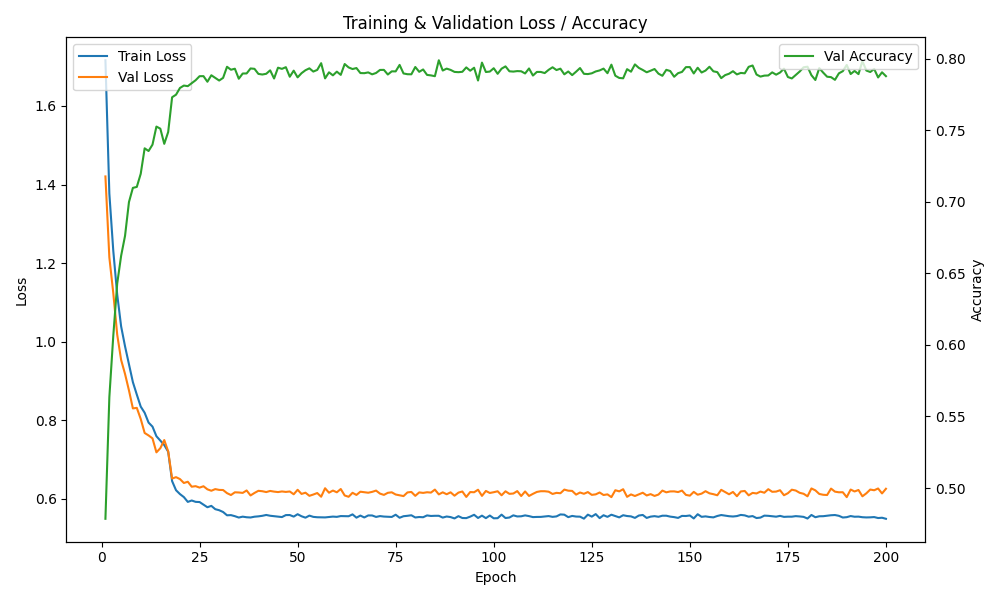
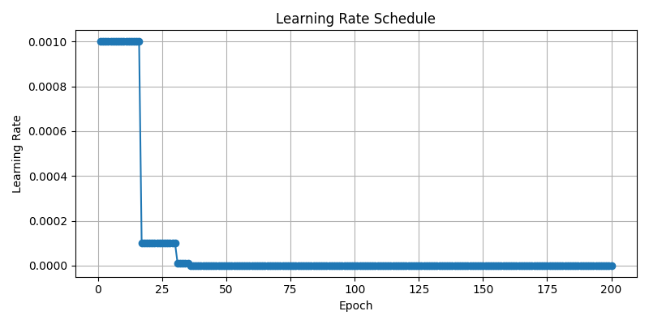
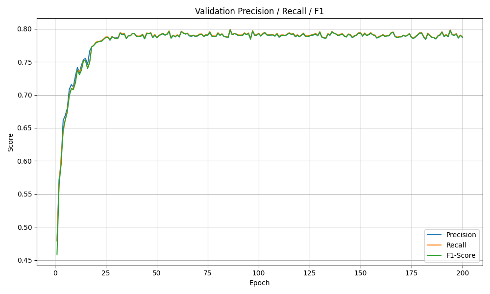

# CIFAR-10 Training Pipeline

A complete PyTorch implementation for training a custom CNN on the CIFAR-10 dataset with full control over data processing, training, and visualization.

## Features

- **Custom Data Pipeline**: Manual download and preprocessing of CIFAR-10 dataset
- **Modular Design**: Separate training and visualization scripts
- **Comprehensive Metrics**: Accuracy, Precision, Recall, F1-Score tracking
- **Checkpointing**: Resume training from any epoch
- **Reproducible Results**: Seed control for consistent outputs
- **Visualization**: Training history plots and metrics dashboard

## Performance

With the default configuration, this pipeline achieves:
- **Final Test Accuracy: 0.8133 (81.33%)**

## Project Structure

```
.
├── train.py              # Main training script
├── visualize.py          # Visualization script for training history
├── requirements.txt      # Python dependencies
├── README.md            # This file
├── checkpoints/         # Saved model checkpoints (created during training)
├── plots/              # Generated visualization plots (created by visualize.py)
├── data_raw/           # Raw CIFAR-10 data (downloaded automatically)
└── my_cifar_data/      # Processed PNG images organized by class
    ├── train/
    │   ├── 0_plane/
    │   ├── 1_car/
    │   └── ...
    └── test/
        ├── 0_plane/
        ├── 1_car/
        └── ...
```

## Installation

1. Clone this repository
2. Install dependencies:
```bash
pip install -r requirements.txt
```

## Usage

### Training

Run the training script with default parameters:
```bash
python train.py
```

Or customize the training parameters:
```bash
python train.py --epochs 200 --batch-size 64 --lr 0.001 --seed 42 --checkpoint-dir ./checkpoints
```

#### Command Line Arguments

- `--lr`: Learning rate (default: 0.001)
- `--epochs`: Number of training epochs (default: 25)
- `--batch-size`: Batch size for training (default: 64)
- `--seed`: Random seed for reproducibility (default: 42)
- `--checkpoint-dir`: Directory to save checkpoints (default: ./checkpoints)

### Visualization

After training, generate visualization plots:
```bash
python visualize.py --checkpoint-file ./checkpoints/checkpoint_epoch_199.pth
```

#### Visualization Options

- `--checkpoint-file`: Path to checkpoint file (required)
- `--output-dir`: Directory to save plots (default: ./plots)

The visualization script generates:
- `loss_accuracy_plot.png`: Training/validation loss and validation accuracy
- `metrics_dashboard.png`: Precision, recall, and F1-score trends
- `lr_schedule.png`: Learning rate schedule over epochs

## Architecture

### Model (Net)

The CNN architecture consists of:

**Feature Extractor:**
- 3 convolutional blocks (Conv2d → ReLU → MaxPool2d)
- Filter progression: 3 → 32 → 64 → 128 channels
- Spatial reduction: 32×32 → 16×16 → 8×8 → 4×4

**Classifier:**
- Fully connected layers with ReLU activation
- Dropout layers for regularization
- Output: 10 classes (CIFAR-10)

### Data Processing

1. **Download**: Automatic download of CIFAR-10 dataset
2. **Extraction**: Raw batch files extracted from tar.gz
3. **Preprocessing**: Convert binary data to PNG images organized by class
4. **Augmentation**: Random crop and horizontal flip for training data
5. **Normalization**: Standard CIFAR-10 normalization values

### Training Features

- **Optimizer**: Adam with configurable learning rate
- **Loss Function**: CrossEntropyLoss for multi-class classification
- **Scheduler**: ReduceLROnPlateau (reduces LR by factor 10 after 2 epochs without improvement)
- **Metrics**: Comprehensive tracking using torchmetrics
- **Checkpointing**: Automatic saving and resuming from interruptions

## Implementation Details

### Custom Dataset Class

The `CustomImageDataset` class:
- Recursively scans directory structure
- Loads PNG images on-the-fly
- Applies transformations during training
- Supports both training and testing splits

### Reproducibility

Full reproducibility is ensured through:
- Seeded random number generators (Python, NumPy, PyTorch)
- Deterministic CUDA operations
- Fixed data splitting with seeded generators

### Checkpointing System

Each checkpoint saves:
- Model state dictionary
- Optimizer state
- Learning rate scheduler state
- Complete training history
- Current epoch number

## Results

The pipeline achieves competitive performance on CIFAR-10:

| Metric | Value |
|--------|-------|
| Test Accuracy | 80.40% |
| Training Time | ~200 epochs |
| Model Size | Lightweight CNN |




